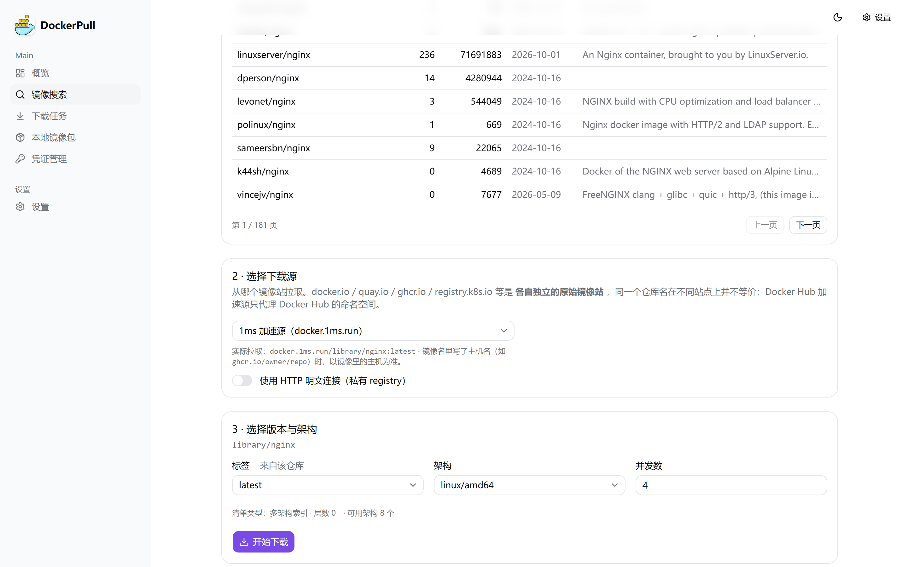
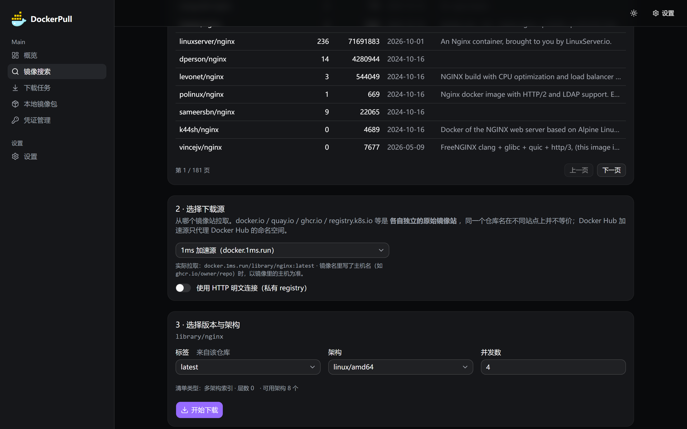
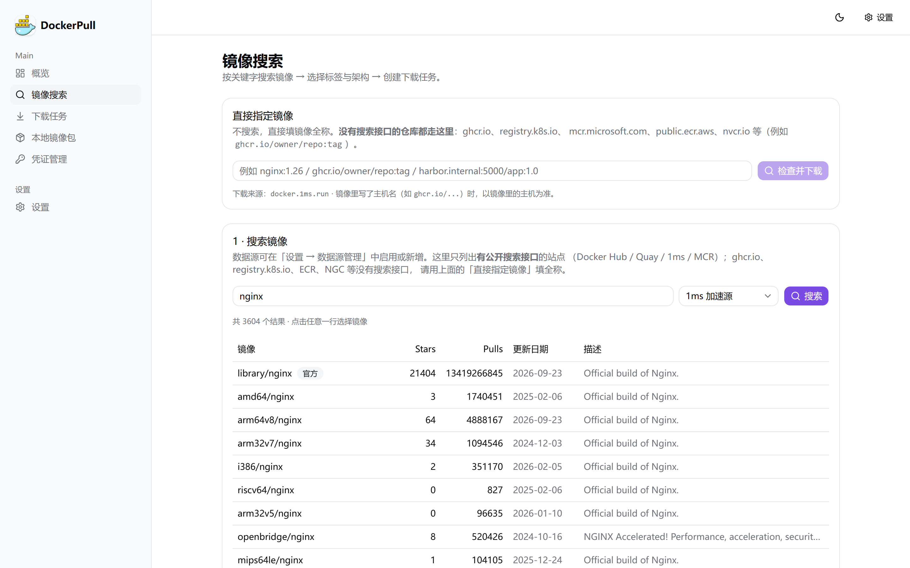
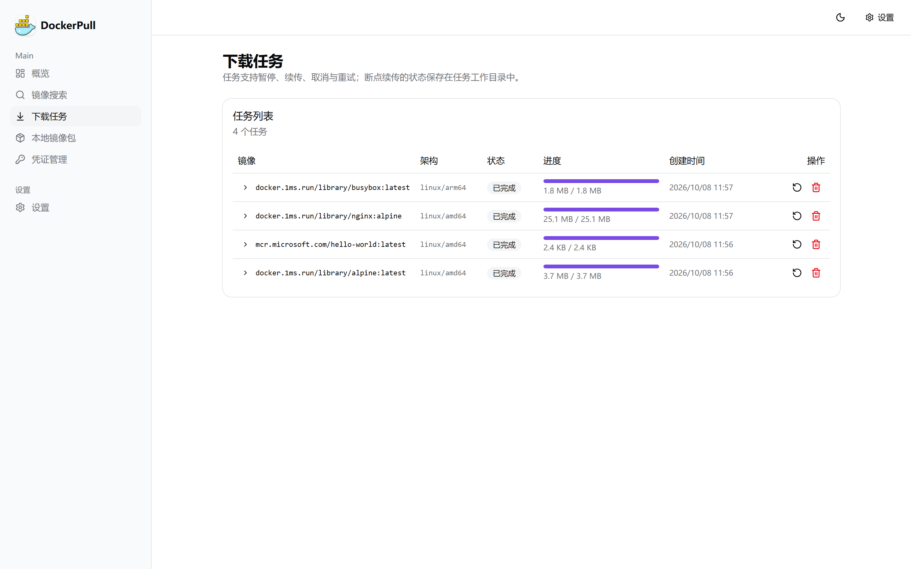
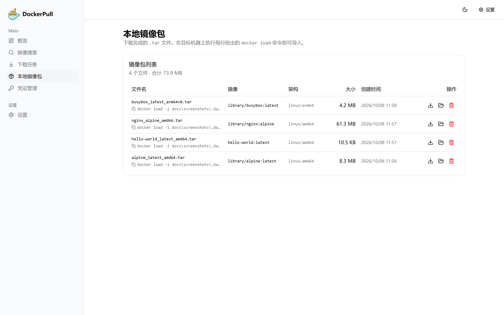
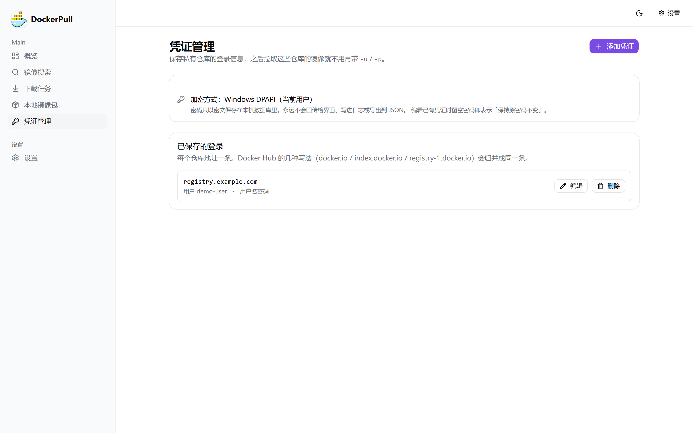
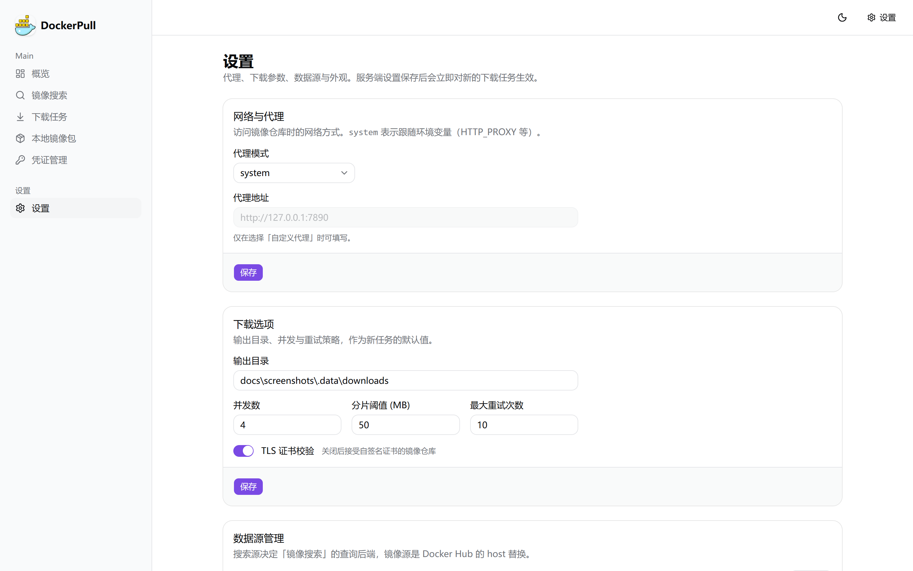

# DockerPull

**在内网、离线、没有 Docker 环境的机器上，把 Docker 镜像拉下来打包成 `docker load` 可以直接导入的 `.tar`。**

外网拉取 → 得到一个 tar → 拷进内网 → `docker load -i`。没有守护进程、不依赖 Docker、
不依赖 Python，**一个二进制**同时提供命令行和图形界面。

```
$ dockerpull pull -i nginx:1.26 -a amd64 -o ./downloads
✅ 镜像 nginx:1.26 下载完成！
💡 导入命令: docker load -i ./downloads/nginx_1.26_amd64.tar
⏱️  总耗时: 00:00:42

$ ./dockerpull          # 打开 http://localhost:8080 就是图形界面
```

- 语言 / 运行时：Go 1.25（纯 Go SQLite，无需 CGO）+ Next.js 静态导出
- 数据：默认 SQLite（`./data`），可选 PostgreSQL
- **单用户本机工具：没有登录、没有账号、没有权限模型**（这是设计决定，见 [docs/CONTRACT.md](docs/CONTRACT.md)）

---

## 简介

DockerPull 解决的是一个具体的痛点：**目标机器不能访问公网 registry，甚至没装 Docker**。
你要在能上网的机器上把镜像取下来，做成一个可搬运的文件，再导入内网。

旧版本是三个 Python 脚本（一个全功能 CLI、一个 1ms 加速源 fork、一个 Gradio GUI），
同一套引擎写了三遍，修 bug 要修 1~3 次，于是三个版本的行为并不一致。
新版本把引擎收敛成一份 Go 代码，CLI 和 GUI 都只是它的两个外壳。
旧版本到底有哪些能力、哪些是坏的、参数怎么对应，见 **[docs/FEATURES.md](docs/FEATURES.md)**。

---

## 界面

Web GUI 与 CLI 共用同一套服务端路由，所以两边看到的状态、错误、进度口径完全一致。
界面是中文的，支持浅色/深色主题（右上角切换）。

**搜索 → 选择下载源 → 选择版本与架构 → 下载**，每一步都在同一页完成：



<details>
<summary>深色主题</summary>



</details>

### 五个页面

| 页面 | 截图 |
|---|---|
| **镜像搜索** — 四个可搜索源，结果带 Star / 拉取量 / 更新时间 / 官方标记；上方是「直接指定镜像」，没有搜索接口的仓库（ghcr.io、registry.k8s.io、ECR、NGC…）从这里填全称 |  |
| **下载任务** — 状态、每层进度、大小、实时速度与 ETA；支持暂停 / 继续 / 取消 / 重试（三者语义不同），服务端 SSE 推送 |  |
| **本地镜像包** — 已生成的 `.tar` 列表，可下载、**打开所在文件夹**、删除；页面上直接给出 `docker load -i` 命令 |  |
| **凭证管理** — 私有仓库登录信息，加密存储（Windows DPAPI / 其他平台 AES-256-GCM），密钥只写不可读 |  |
| **设置** — 镜像源与搜索源的增删改/启停/排序、公共镜像站目录、代理、并发、TLS、输出目录 |  |

> 截图由 `scripts/screenshots.ps1` 通过 Chrome DevTools Protocol 自动生成
> （等数据真正渲染完再拍，而不是页面 load 就拍），可以随时重新生成。

---

## 特性

五个功能域，CLI 与 GUI 共用同一条代码路径。

### F1 镜像搜索

- 关键词搜索，多搜索源可切换（内置 **Docker Hub 官方 / Quay.io / 1ms 加速源 / MCR**），源可在设置里增删改、启停、排序
- 没有公开搜索接口的站点（ghcr.io、registry.k8s.io、ECR、NGC…）用「直接指定镜像」填全称；详见 [哪些源能搜索](#哪些源能搜索)
- 结果表格带描述、Star、拉取量、更新时间、是否官方
- 列某个仓库的全部 tag（含可用架构信息）
- CLI 支持 `--json`，方便脚本消费

### F2 镜像下载

- 引用解析：`nginx`、`nginx:1.26`、`harbor.example.com/library/nginx:1.26`，以及 **`nginx@sha256:...` 摘要引用**
- 多架构：自动读取镜像发布的架构并让你选（`amd64` / `arm64` / `arm/v7` / `riscv64` …），也支持 `--list-arch` 只看不下载
- registry 认证：按 `WWW-Authenticate` 自动走 Bearer token 或 Basic；私有仓库用 `-u/-p`
- 多镜像源：内置 10 个（Docker Hub 官方、1ms、南大、轩辕 ×2、DaoCloud 系列），也可自定义；`--mirror` 可按任务选源
- 公共镜像源开箱即用：`ghcr.io` / `quay.io` / `registry.k8s.io` / `mcr.microsoft.com` / `public.ecr.aws` / `nvcr.io` /
  `registry.gitlab.com` / `cgr.dev` / `gcr.io`（直接写 `主机/命名空间/仓库` 即可拉取；其中 quay.io 与 mcr.microsoft.com 支持关键词搜索）
- 私有仓库凭证管理：`login` / `logout` 保存登录信息（Windows 用 DPAPI 加密、密钥不落盘），之后拉私有镜像免带 `-u/-p`
- **TLS 证书校验默认开启**（`--no-verify-tls` 可关）；`--insecure` 表示 registry 走明文 HTTP
- 代理三态：跟随系统 / 直连 / 自定义
- 大 blob 分片下载 + 多线程并发（默认 4）
- 产物与 `docker load` 完全兼容（正确的 `manifest.json` / `repositories` / 层 fakeid 链）

### F3 断点续传

- 进度落盘在 `<WorkDir>/progress.json`：进程被杀、Ctrl+C、机器重启之后，重跑同一条命令就接着下
- 大文件用**分片账本**记录每一片是否完成，重启后跳过已完成分片
- 服务器如果不支持 Range（返回 200 全文），会**截断重下**而不是硬追加——避免"半截文件 + 全文"的静默损坏
- 每个 blob 下完即校验 digest，失配就删掉重下
- 暂停 / 继续 / 重试是三个不同语义：暂停保留进度，继续从断点接，重试从 0 重来

### F4 进度管理

- 任务状态机：排队 / 下载中 / 已暂停 / 成功 / 失败 / 已取消
- 每层进度条、整体百分比、实时速度、**ETA**、已下载/总大小
- 服务端 SSE 推送（`/api/events`），GUI 无需轮询；任务落库，刷新页面进度不丢
- CLI 保留旧版的中文交互提示与进度条；`--ci` / `--quiet` 关闭动画，适合流水线

### F5 本地镜像包管理

- 列出已生成的 `.tar`（文件名、镜像、tag、架构、大小、生成时间），并与磁盘目录自动对账
- 浏览器里直接下载 tar 到本机，或**在资源管理器中打开所在文件夹**（服务端执行，路径经与下载/删除相同的校验）
- 删除产物按数据库记录执行并校验路径，不会再出现"传一个 `../` 就删任意文件"的问题
- 页面上直接给出 `docker load -i <文件>` 的导入命令

---

## 架构

一个引擎、两个外壳。CLI 与 GUI 都通过同一份服务端路由表工作，所以行为、错误信息、
进度口径永远一致。

```
        CLI  dockerpull pull/search/tags/tasks/serve       GUI  Next.js  / /search /tasks /artifacts /settings
                        │                                              │
                        │ 同进程调用                                    │ HTTP /api/* + SSE
                        ▼                                              ▼
                 ┌────────────────────────────────────────────────────────────┐
                 │ internal/server   声明式路由 + 统一 JSON 封套 + SSE          │
                 └───────┬───────────────────────┬────────────────────────────┘
                         ▼                       ▼
                 internal/tasks            internal/store
                 任务生命周期 / 进度扇出      tasks / task_layers / sources /
                         │                  settings / artifacts (SQLite/PG)
                         ▼
                 internal/puller
                 可续传下载 + digest 校验 + docker load 兼容打包
                         │
                         ▼
                 internal/registry
                 引用解析 / 认证 / 清单 / 架构解析 / 搜索源
```

分层规则：`registry` 不认识任务，`puller` 不认识数据库，`tasks` 负责把两者接起来并落库，
`server` 只做 HTTP 与事件扇出。要扩展时先看 [docs/CONTRACT.md](docs/CONTRACT.md)。

---

## 快速开始

前置：Go 1.25+、Node 22+、pnpm 10（`corepack enable`）。

```bash
git clone https://github.com/Potterluo/docker-pull-tar.git
cd docker-pull-tar

make build              # 前端静态导出 → go:embed → 单二进制
./bin/dockerpull        # 启动 GUI，浏览器打开 http://localhost:8080
```

Windows 上不装 make 也能构建：

```powershell
powershell -File scripts\build.ps1        # 等价于 make build
.\bin\dockerpull.exe
```

打开 <http://localhost:8080> 即可使用：**没有登录页、没有向导**，直接是应用。
数据默认落在 `./data`（SQLite 库 + 默认下载目录 `./data/downloads`）。

只用命令行也完全可以：

```bash
./bin/dockerpull pull -i nginx:latest -o ./downloads
./bin/dockerpull search -k redis --json
```

---

## CLI 用法

二进制 `dockerpull`；**不带子命令时等于 `serve`**（所以裸跑就是启动 Web 界面）。
退出码：`0` 成功 / `1` 失败 / `2` 用法错误。下面示例里的 `./dockerpull` 就是 `./bin/dockerpull`
（Windows 下为 `.\bin\dockerpull.exe`）。

```
dockerpull [serve] [-port N] [-data-dir PATH] [-dev-proxy URL] [-version]
dockerpull pull   -i <image> [-a amd64] [-o DIR] [--workers N] [--insecure]
                  [-r REGISTRY] [-u USER] [-p PASS] [--mirror HOST|ID]
                  [--proxy URL] [--no-proxy] [--no-verify-tls]
                  [--ci] [--quiet] [--list-arch] [--debug]
dockerpull search -k <keyword> [--source ID] [--page N] [--page-size N] [--json]
                  [--no-download] [--tag T] [-a ARCH] [-o DIR]
dockerpull tags   -i <image> [--source ID] [--json]
dockerpull tasks  [list | show <id> | pause <id> | resume <id> | cancel <id> | retry <id>
                  # 省略子命令即 list：`dockerpull tasks --data-dir ./data` 也能用
                  | rm <id> [--files]]
dockerpull version
```

### 搜索 → 下载：先选「下载源」

搜索出来的结果只是一个**仓库名**（例如 `library/nginx`），不是位置。所以图形界面的流程是：

```
1 搜索镜像  →  2 选择下载源  →  3 选择版本与架构  →  下载
```

**第 2 步必须在第 3 步之前**：标签列表和架构列表都是从「下载源」这台仓库的 manifest 里读出来的，
同一个 tag 在 quay.io 上存在、在 docker.io 上未必存在（改动下载源会自动重新解析）。

`docker.io` / `quay.io` / `ghcr.io` / `registry.k8s.io` 等是**各自独立的原始镜像站**，
同一个名字在不同站点上并不等价；而 **Docker Hub 加速源**（1ms / 南大 / 轩辕 / DaoCloud 系列）
只是 Docker Hub 命名空间的代理，所以选它时 `nginx` 会补成 `library/nginx`。

- 下载源下拉里带 `默认` 的那一项来自设置（`default_mirror`），**初始值不一定是 docker.io**。
- 镜像名里自带主机名时（`ghcr.io/owner/repo:tag`）**以镜像里的主机为准**，下拉选择不生效。
- 不想搜索时用「直接指定镜像」框，直接填 `nginx:1.26` / `harbor.internal:5000/app:1.0` 也可以。

命令行等价做法：

```bash
dockerpull pull -i nginx:1.26 --mirror docker.1ms.run     # 指定下载源（ID 或 host）
dockerpull pull -i ghcr.io/owner/repo:tag                  # 全称，主机名以镜像里为准
dockerpull search -k nginx --source 1ms --select 1         # 搜索并下载：自动带上该源的下载主机
```

### 哪些源能搜索

| 站点 | 关键词搜索 | 说明 |
|---|---|---|
| Docker Hub / 1ms | ✅ | Hub 搜索 API |
| Quay.io | ✅ | `/api/v1/find/repositories` |
| MCR (mcr.microsoft.com) | ✅ | MCR 没有搜索 API，但它匿名公开**完整目录**（`/v2/_catalog`，约 3861 个仓库 / 160KB），本工具拉取一次并本地过滤（缓存 15 分钟） |
| ghcr.io | ❌ | GitHub 的搜索只覆盖仓库/代码，不覆盖 registry 包；`/v2/_catalog` 返回 401 |
| registry.k8s.io | ❌ | `/v2/_catalog` 返回 404（它是 Artifact Registry 的门面） |
| public.ecr.aws / nvcr.io | ❌ | 目录与搜索接口都需要认证（实测 401） |
| gcr.io / cgr.dev / registry.gitlab.com | ❌ | 没有匿名搜索接口（GitLab 只能按项目定位） |

不能搜索的站点**照样能下载**——用「直接指定镜像」填全称（`ghcr.io/owner/repo:tag`）即可。

### 本地镜像包

「本地镜像包」页面每个 tar 有三个操作：**下载**、**打开所在文件夹**（在资源管理器中选中该文件）、**删除**。
打开文件夹是服务端动作（浏览器无法打开本地目录），路径由服务端从数据库行取出并做与下载/删除相同的校验。

### Windows 镜像与私有 HTTP 仓库

- **Windows 镜像可以用。** Windows 基础镜像的底层是 *foreign layer*（不存放在 registry 里，
  manifest 用 `urls` 指向 Microsoft CDN）。工具会按 `urls` 下载并照样做 digest 校验，
  产出的 tar 里包含完整的基础层。实测 `hello-world:nanoserver1709`（242.9MB tar）：
  `docker load` 得到 `os=windows arch=amd64`。注意：**架构必须显式选**
  `windows/amd64`——`linux/amd64` 不会、也不应该去命中一个 Windows 镜像。
- **私有 HTTP 仓库**：下载源旁边的「使用 HTTP 明文连接」开关会同时作用于*查询标签/架构*和*下载*
  两步（只作用于一步会出现「选得出来、下不下来」）。
- **标签来自你要拉取的那台仓库**（不是搜索 API），所以下拉里的 tag 一定存在于下载端；
  界面会标明来源，`dockerpull tags -i <镜像> --mirror <源>` 同序，`--json` 里带 `tagsFrom`。

### 私有仓库凭证

```bash
# 保存一次，之后拉该仓库的私有镜像就不用再带 -u/-p
dockerpull login ghcr.io -u <用户名> -p <访问令牌>
dockerpull login harbor.internal:5000 -u admin -p <密码> --note 内网仓库
dockerpull pull -i ghcr.io/<组织>/<私有镜像>:<tag>

dockerpull credentials list          # 查看已保存的凭证（只显示仓库/用户名，不显示密码）
dockerpull credentials protection    # 查看本机用哪种方式加密，以及它不防什么
dockerpull logout ghcr.io            # 删除
```

图形界面里对应左侧「凭证管理」页：添加 / 编辑 / 删除，密码框留空表示保持原密码不变。
密码只以密文存进本机数据库，**不会**回传到界面、写进日志或出现在 `--json` 输出里。

### 复制即用

```bash
# 启动 GUI（自定义端口与数据目录）
./dockerpull
./dockerpull serve -port 9090 -data-dir /srv/dockerpull

# 最常用：拉取 + 导出（默认 amd64、4 并发）
./dockerpull pull -i nginx:1.26 -o ./downloads

# 指定架构，走 1ms 加速源
./dockerpull pull -i alpine:latest -a arm64 --mirror 1ms -o ./out

# 私有仓库（Bearer / Basic 自动识别）
./dockerpull pull -i harbor.example.com/library/nginx:1.26 -u admin -p 'secret'

# 只看镜像有哪些架构，不下载
./dockerpull pull -i nginx:latest --list-arch

# CI 流水线：无交互、无动画，失败即非 0 退出
./dockerpull pull -i nginx:1.26 --ci --quiet -o ./dist

# 下载中断了？同一条命令再跑一次即可，同一个 -o 目录就是同一个断点
./dockerpull pull -i nginx:1.26 -a amd64 -o ./downloads

# 搜索与 tag（脚本化）
./dockerpull search -k redis --source dockerhub --json
./dockerpull tags -i redis --source 1ms

# 任务管理（含暂停/续传/重试/清理）
./dockerpull tasks list
./dockerpull tasks show 3f2a1b
./dockerpull tasks pause  3f2a1b
./dockerpull tasks resume 3f2a1b      # 从断点继续
./dockerpull tasks retry  3f2a1b      # 清空账本，从 0 重来
./dockerpull tasks rm     3f2a1b --files
```

### 内网导入

```bash
# 1. 外网机器
./dockerpull pull -i nginx:1.26 -a amd64 -o ./downloads
# 2. 拷贝 ./downloads/nginx_1.26_amd64.tar 到内网机器
# 3. 内网机器
docker load -i nginx_1.26_amd64.tar
docker images
```

**旧版兼容参数**（老脚本可直接把 `DockerPull.exe` 换成 `dockerpull pull`）：
`-i` `-a` `-o` `-r` `-u` `-p` `--workers` `--ci` `--quiet` `--list-arch` `--insecure` `--proxy` `--no-proxy` `--debug`。
完整对照表见 [docs/FEATURES.md](docs/FEATURES.md) 第 9 节。

---

## 配置说明

### 环境变量（进程引导，`APP_*`）

| 变量 | 默认值 | 说明 |
|---|---|---|
| `APP_PORT` | `8080` | HTTP 端口 |
| `APP_BIND` | `loopback` | `loopback` 只监听本机；`all` 监听所有网卡 |
| `APP_DATA_DIR` | `./data` | 数据目录（SQLite 库 + 默认下载目录） |
| `APP_DB_TYPE` | `sqlite` | `sqlite` 或 `postgres` |
| `APP_DB_DSN` | 空 | PostgreSQL DSN，或显式 SQLite 路径 |
| `APP_DB_AUTO_MIGRATE` | `true` | 启动时自动建表/迁移 |
| `APP_RATE_LIMIT_RPM` | `0`（不限） | 每个客户端 IP 每分钟 `/api/*` 请求上限 |
| `APP_LOG_LEVEL` | `info` | `debug` / `info` / `warn` / `error` |
| `APP_DEV_PROXY` | 空 | 指向 `next dev`，把 UI 反向代理进来（仅开发用） |

也可以写在 `.env` 里（真实环境变量优先）。真实环境变量与 `.env` 样例见 [.env.example](.env.example)。

### 应用设置（存数据库，GUI `/settings` 与 CLI 共用）

| Key | 默认值 | 说明 |
|---|---|---|
| `output_dir` | `<dataDir>/downloads` | `.tar` 输出目录 |
| `workers` | `4` | 并发下载层数 |
| `verify_tls` | `true` | 是否校验 TLS 证书 |
| `proxy_mode` | `system` | `system` / `none` / `custom` |
| `proxy_url` | 空 | `proxy_mode=custom` 时使用 |
| `default_mirror` | `dockerhub` | 引用未写 registry 时使用的镜像源 |
| `default_search_source` | `dockerhub` | 默认搜索源 |
| `chunk_threshold_mb` | `50` | 超过该大小改用分片下载 |
| `max_retries` | `10` | 单个 blob 的重试上限 |

---

## 开发

```bash
make build          # 完整单二进制（前端 → embed → go build）
make test           # go test ./...
make lint           # go vet ./... + cd web && pnpm lint

# 前后端热重载（两个终端）
make dev-frontend   # 终端 1: next dev（:3000，HMR）
make dev            # 终端 2: Go 服务（:8080，把 UI 反代到 :3000）
# 浏览器只访问 http://localhost:8080
```

Windows 无 make：

```powershell
powershell -File scripts\build.ps1             # 构建
powershell -File scripts\build.ps1 -Desktop    # 顺便构建桌面壳
go build ./... ; go vet ./... ; go test ./...
cd web ; pnpm build
```

提交前的完成标准（Definition of Done）：`go build ./...`、`go vet ./...`、`go test ./...`、
`cd web && pnpm build` 全部通过。写代码前请读 [AGENTS.md](AGENTS.md)（AI/人类协作者的约定）
和 [docs/CONTRACT.md](docs/CONTRACT.md)（冻结接口）。

---

## 打包

**单二进制**：前端以 `output: "export"` 静态导出后用 `go:embed` 打进 Go 程序，
所以 `bin/dockerpull` 拷到任何同名平台机器上就能跑（`CGO_ENABLED=0`，无外部依赖）。

**Docker**：

```bash
docker build -t dockerpull .
docker run --rm -p 8080:8080 \
  -e APP_PORT=8080 -e APP_DATA_DIR=/data \
  -v dockerpull-data:/data \
  dockerpull
```

镜像里的 `/data` 是数据卷（SQLite 与产物）。也可以用 [docker-compose.yml](docker-compose.yml)：

```bash
docker compose up --build app            # 单二进制容器
docker compose --profile postgres up --build   # 顺带起一个 PostgreSQL，切到 PG 存储
```

**Windows 桌面版（Wails 原生窗口）**：同一个服务端 + 同一套内嵌 UI，跑在一个原生窗口里
（内部监听回环随机端口；SSE 走真实 TCP，因此不要改成自定义协议）。

```bash
make desktop                                       # 需要 Wails 依赖
powershell -File scripts\build.ps1 -Desktop        # Windows
```

改了 `web/src/app/icon.svg` 之后要重新生成图标资源：先光栅化 PNG，再 `make icons`，然后重建桌面目标。

### 桌面版打不开怎么办

桌面版是 `-H windowsgui` 链接的——**它没有控制台**。所以启动失败时，错误既不会打印到
任何窗口，也不会有"闪一下就消失"的痕迹：双击图标就是"什么都没发生"。为此桌面版做了三件事：

1. **数据目录逐个探测可写性**，不再写死 `%APPDATA%`。顺序是：

   ```
   APP_DATA_DIR → %APPDATA%\DockerPull → %LOCALAPPDATA%\DockerPull → <exe 同级>\data
   ```

   每个候选都会**真的创建并写入一个文件**再删掉——能 `mkdir` 不等于能写文件，而"能建目录
   但写不了"正是 `readonly database` / `CANTOPEN` 的来源。

2. **WebView2 的配置目录也放在数据目录下**（`<数据目录>\webview2`）。它的默认值是
   `%APPDATA%\<exe 名>`，那是**第二个**对可写 `%APPDATA%` 的硬依赖；不接管的话，即使修好了
   数据目录，也会在 WebView2 初始化时以一个 800700aa 失败。

3. **致命错误写日志 + 弹原生对话框**：

   - 日志：`<数据目录>\dockerpull-desktop.log`
   - 对话框标题：`DockerPull 无法启动`，正文含失败原因、数据目录、日志路径，以及**被跳过的
     候选目录和各自的失败原因**。

排错顺序：先看对话框，再看 `<数据目录>\dockerpull-desktop.log`；如果 `%APPDATA%` 不可写
（漫游配置被关闭 / 重定向到 OneDrive / 被杀软拦截），设 `APP_DATA_DIR` 指一个可写目录即可：

```powershell
$env:APP_DATA_DIR = "D:\dockerpull-data"
.\bin\dockerpull-desktop.exe
```

---

## 从旧版迁移

旧版是 Python（`DockerPull.exe` / `python app.py`），新版是单二进制 Go 程序，参数基本对齐、
默认值更安全（TLS 校验默认开、失败退出码不再静默 0）。**完整对照表**——旧 CLI 每个参数、
旧 GUI 每个控件、以及有意丢弃的行为——都在 [docs/FEATURES.md](docs/FEATURES.md) 第 9 节。

三句话版本：

1. 命令行：`DockerPull.exe -i nginx:latest -a arm64 -o ./out` → `dockerpull pull -i nginx:latest -a arm64 -o ./out`
2. 图形界面：`python app.py`（:7860）→ `dockerpull`（:8080），页面重新划分成 概览 / 搜索 / 任务 / 产物 / 设置
3. 有意去掉的：Gradio 的 `--select-index` 位置索引选结果、0.5s 轮询的 HTML 进度面板
   （换成 SSE 推送）、"多源 = 手选一个 host 字符串"（换成显式 `--mirror`，但**不承诺自动竞速/故障转移**）

---

## 致谢

本项目源自 **topcss Jack** 的原始 Python 工具，并由 **Potterluo Keriko**、**wang-lg** 等网友持续贡献。
感谢最初的实现和那些踩过的坑——这次重写的很多设计正是对着它们定的。

## License

[MIT](LICENSE)
